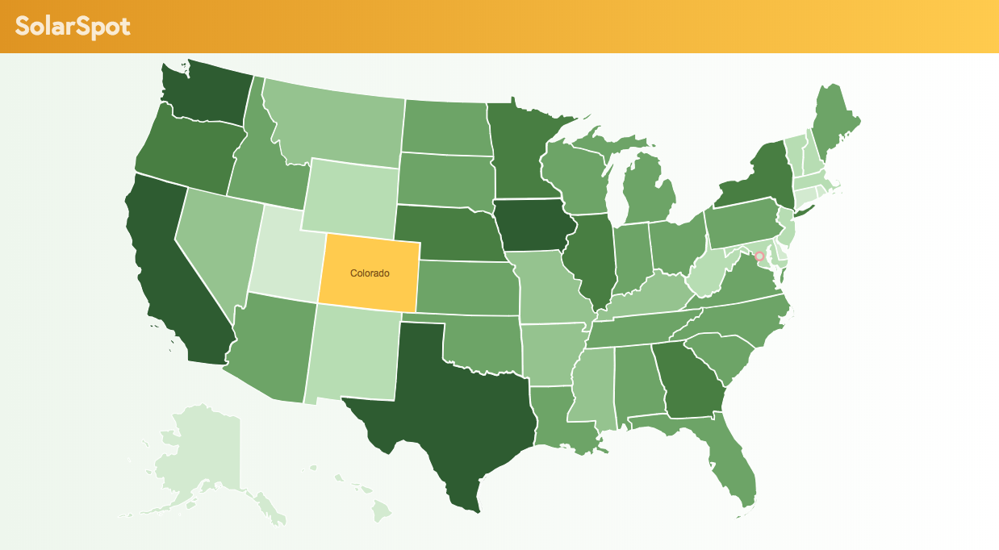

# SolarSpot

SolarSpot was created using Angular 5 in an effort to learn the basics of Angular as well as building SVGs on the fly.  Individual state pages are built with Plotly charts.  It pulls data from the U.S. Energy Information Administration API (https://www.eia.gov/) relating to alternative energy production in U.S. states.

Angular 5 is pretty cool--works in many ways like React but with a few niceties like a CLI which generates many of the files needed for building components.  I like Angular's opinionated file structure as well.  It's easy to follow.

To build the clickable state map, I simply dropped the guts from a wikipedia svg map of the United States into an HTML file, added methods on the states for determining colors, and used some of Angular's input events to make them clickable/hoverable.  It was surprisingly easy to do.

